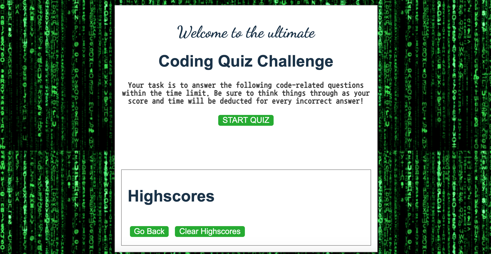
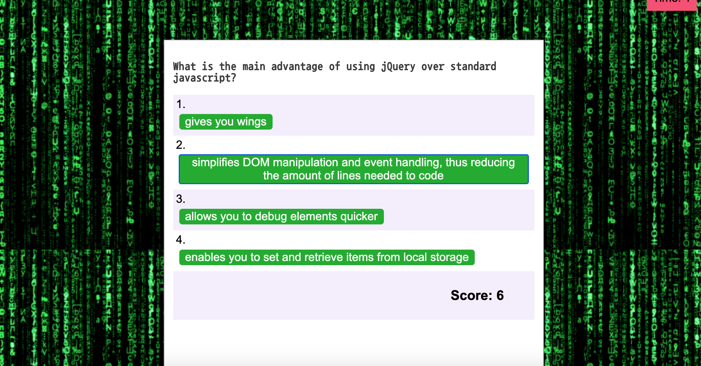

# Code-quiz-HW4

This application uses javascript, HTML and CSS where the user begins the quiz with a series of 7 multiple choice code-related questions. Each question contains 4 choices. Once the user starts the quiz, a timer is activated, which counts down from 60 seconds. 
For each correct selection, the user gets 6 points, and for each incorrect guess, they get penalised with a time deduction of 8 seconds. 

## Application

